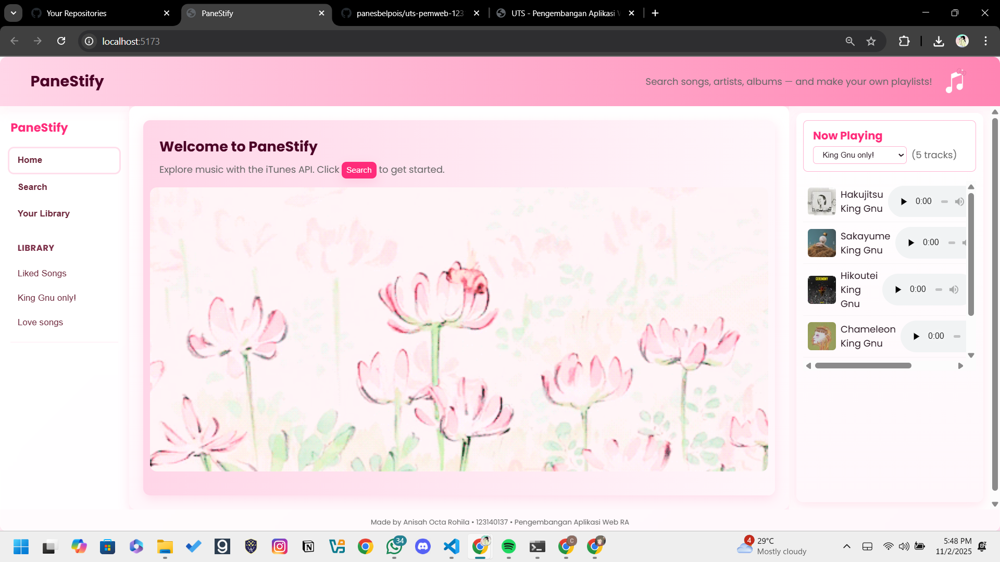
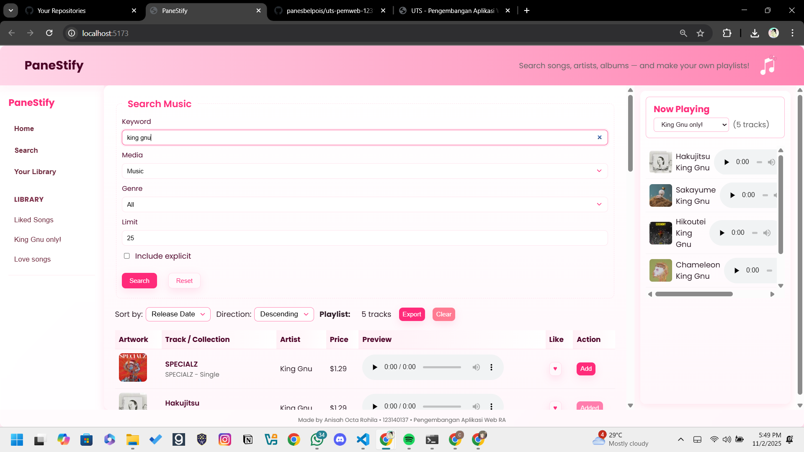
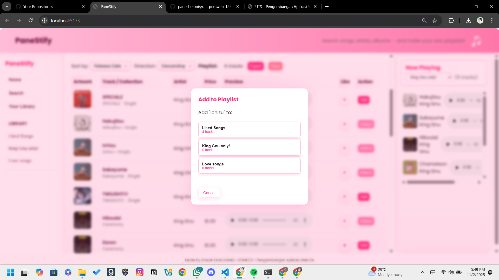
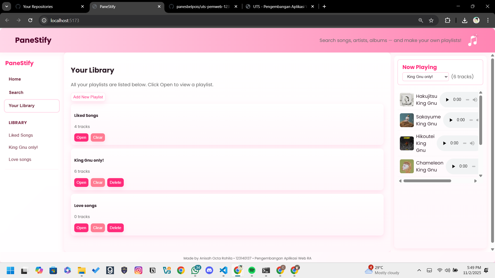
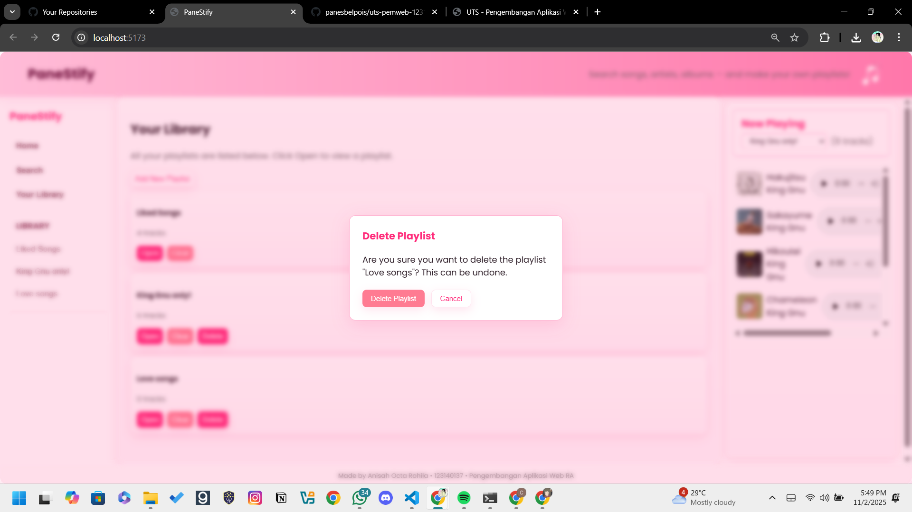
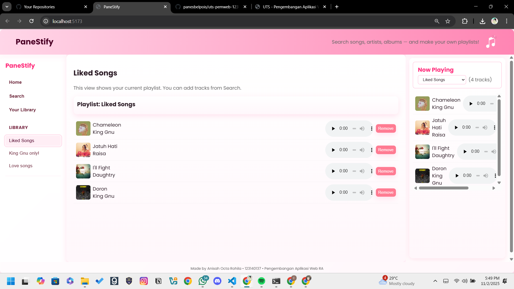
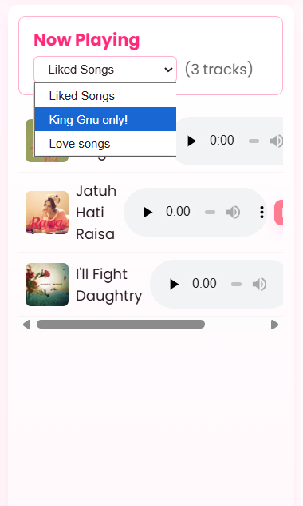
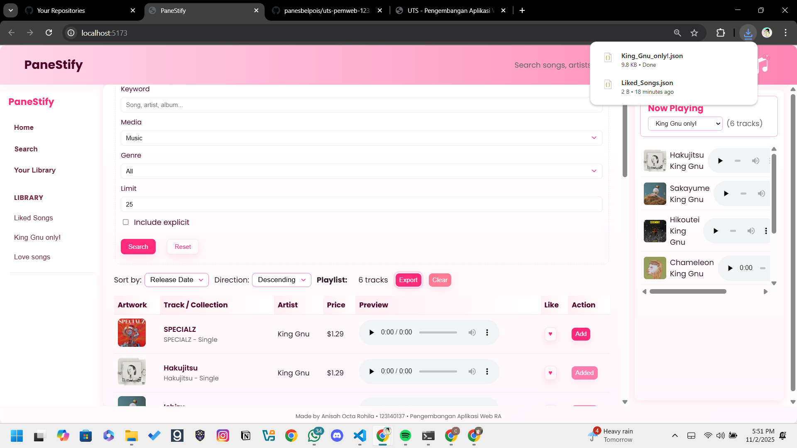

# PaneStify - Music Explorer App

## Identitas
**Nama:** Anisah Octa Rohila  
**NIM:** 123140137  
**Kelas:** Pengembangan Aplikasi Web RA  
**Studi Kasus:** Music Explorer (digit terakhir NIM: 7)

## Deskripsi Aplikasi
PaneStify adalah aplikasi web untuk mencari dan mengelola musik menggunakan iTunes Search API. Aplikasi ini memungkinkan pengguna untuk:
- Mencari lagu, album, dan artis
- Mendengarkan preview lagu
- Membuat dan mengelola playlist
- Menyimpan lagu favorit di "Liked Songs"
- Mengekspor playlist dalam format JSON

## Teknologi yang Digunakan
- React + Vite
- iTunes Search API
- LocalStorage untuk penyimpanan playlist
- CSS murni dengan Flexbox & Grid
- Responsive design

## Fitur Utama
1. **Form Pencarian Lengkap:**
   - Kata kunci pencarian
   - Tipe media (music, movie, podcast, dll)
   - Genre
   - Limit hasil pencarian
   - Filter konten explicit

2. **Manajemen Playlist:**
   - Menambahkan lagu ke Liked Songs dengan tombol love
   - Membuat playlist baru
   - Menambahkan lagu ke playlist
   - Menghapus lagu dari playlist
   - Mengekspor playlist ke JSON

3. **Fitur Pengurutan:**
   - Berdasarkan tanggal rilis
   - Berdasarkan harga
   - Pengurutan ascending/descending

## Cara Instalasi & Menjalankan Aplikasi
1. Clone repository
   ```bash
   git clone https://github.com/panesbelpois/uts-pemweb-123140137.git
   ```

2. Masuk ke direktori project
   ```bash
   cd uts-pemweb-123140137
   ```

3. Install dependensi
   ```bash
   npm install
   ```

4. Jalankan aplikasi
   ```bash
   npm run dev
   ```

5. Buka browser dan akses `http://localhost:5173`

## Screenshot Aplikasi

### 1. Tampilan Utama (Home)

Halaman utama dengan welcome message

### 2. Tampilan Search

Form pencarian dengan filter:
- Search keyword
- Media type selection
- Genre input
- Result limit
- Explicit content filter
- Sorting options (release date & price)

### 3. Add Song to Playlist

Modal untuk menambahkan lagu ke playlist yang dipilih.

### 4. Your Library

Halaman library menampilkan semua playlist yang telah dibuat.

### 5. Delete Playlist

Pop up konfirmasi penghapusan playlist.

### 6. Tampilan Playlist

Detail playlist dengan daftar lagu dan kontrol pemutaran.

### 7. Now Playing

Panel Now Playing dengan playlist selector dan daftar lagu.

### 8. Export json

Pengguna dapat melakukan export dan langsung terdownload dalam format json.

## Deployment
Aplikasi dapat diakses online melalui:  
[https://uts-pemweb-123140137.vercel.app](https://uts-pemweb-123140137.vercel.app)

## Struktur Project
```
uts-pemweb-123140137/
├── public/
│   ├── assets/
│   ├── screenshots/
│   └── index.html
├── src/
│   ├── components/
│   │   ├── Header.jsx
│   │   ├── SearchForm.jsx
│   │   ├── DataTable.jsx
│   │   ├── DetailCard.jsx
│   │   └── Sidebar.jsx
│   ├── utils/
│   │   └── storage.js
│   ├── App.jsx
│   ├── App.css
│   └── main.jsx
├── package.json
└── README.md
```

## Catatan Tambahan
- Aplikasi menggunakan localStorage untuk menyimpan playlist
- Responsive design untuk desktop dan mobile
- Mendukung fitur audio preview untuk lagu yang tersedia
- Export playlist dalam format JSON
